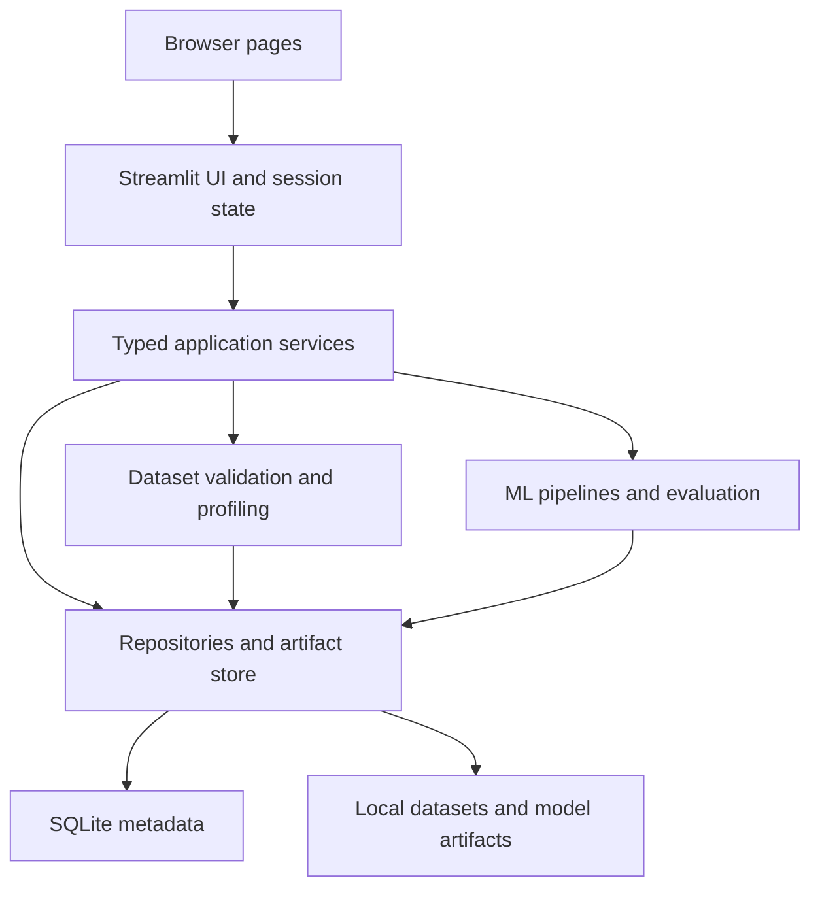
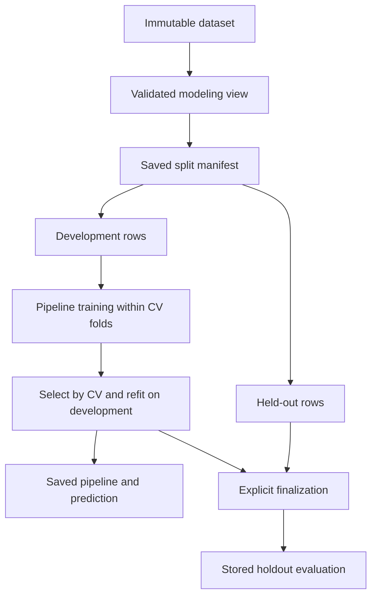

# DataMind — Architecture

## Selected design

A modular Python application with a Streamlit presentation layer, internal service layer, scikit-learn ML layer and local persistence. The browser communicates with Streamlit; the application calls Python services directly. **There is no separate REST server in v1.** Keep service boundaries clean so a future FastAPI/React migration can reuse the ML and persistence code.

## Responsibilities

| Layer | Owns | Must not own |
|---|---|---|
| UI | Forms, charts, input messages, current selection | Fitting logic, raw SQL, artifact paths |
| Services | Workflow, locks, validation, state transitions | Streamlit widgets |
| ML | Estimator registry, pipelines, splits, metrics | Database queries or UI state |
| Repositories | SQL, transactions, schema versioning | Estimator fitting |
| Artifact store | Safe relative paths, checksums, atomic writes | User-supplied executable loading |

## Supervised data lifecycle

1. Validate CSV and persist an immutable original under a generated dataset ID. Record byte hash, parser settings, source and schema.
2. Confirm task/target/features and deterministic row-cleaning policy. Generate a data-view fingerprint and explicit eligible row IDs. Do not learn imputers, category vocabularies or scalers here.
3. Create one development/holdout split and development CV fold manifest. Persist row IDs, seed and fingerprints.
4. Fit fresh pipelines per development fold. Store positive-scale human-readable metrics for every successful trial.
5. Select champion using the predeclared primary CV metric. Refit that pipeline on development rows only, then persist it.
6. Explicit finalization evaluates the selected saved model on holdout once. It does not retrain on holdout. Record metrics in an immutable evaluation record.
7. Prediction uses the selected trial's saved schema and fitted pipeline. Preprocessing is never refitted during prediction.

The split-first and fold-local preprocessing design follows [scikit-learn's leakage guidance](https://scikit-learn.org/stable/common_pitfalls.html). DataMind-specific limits, workflow gates and schema below are design choices in this pack.

## Execution and state

- Training is synchronous and bounded in v1. A submit action runs one experiment under a workspace `FileLock`; additional submissions receive `WORKSPACE_BUSY`.
- Use forms to collect settings; ordinary widget reruns never start training. Generate one submission UUID per intentional submit, store it with a UNIQUE constraint, and reuse it if the UI reruns the same request.
- The lock must also cover finalization and any recovery of stale running jobs. Recovery only occurs after acquiring the lock, so an active run in another browser tab is not marked interrupted.
- SQLite state is authoritative. Session state stores draft settings and selected IDs. A page refresh reconstructs saved history from SQLite.
- Lock acquisition precedes insertion of a new running experiment. Insert with transaction; commit; train outside the transaction; publish artifacts; then commit result references.
- Overall `completed` means the baseline and at least one nonbaseline trial succeeded. Individual failed trials remain visible. If all nonbaseline models fail, mark experiment `failed`.
- On application crash, unfinished rows become `interrupted` during guarded recovery. Retry creates a new experiment with `retry_of_id`; never overwrites old evidence.
- A synchronous sklearn fit does not support reliable instant cancellation here. Show operation stage and elapsed time, not a fake percentage or a nonfunctional Cancel button. A process worker with hard timeouts is future scope.

Streamlit reruns scripts on interactions; session state is useful for drafts but is not durable storage. This is why the design uses SQLite for experiment history. See [Streamlit session-state documentation](https://docs.streamlit.io/develop/concepts/architecture/session-state).

## Persistence layout

- `storage/datamind.sqlite3`: project, dataset, split, experiment, trial, metric, evaluation and artifact metadata.
- `storage/datasets/<dataset_id>/raw.csv`: immutable uploaded or demo data.
- `storage/splits/<split_id>/manifest.json`: explicit row membership and fold definitions.
- `storage/experiments/<experiment_id>/<trial_id>/pipeline.joblib`: own locally trained fitted pipeline.
- Same trial directory: `input_schema.json`, `metrics.json`, `environment.json`, `warnings.json`.
- `storage/exports/<export_id>/`: generated report and model bundle, without raw training data by default.
- `storage/tmp/`: partial writes; not listed as completed artifacts.

Use relative paths in DB and resolve beneath configured `storage/`. Artifact filenames use generated IDs, never uploaded filenames. Original names are display metadata only.

## File/database consistency

SQLite and the filesystem cannot share one transaction. Write a temporary file in the destination filesystem, flush and close, hash it, atomically rename, then transactionally register it. On failure, leave an error record and remove/ignore unregistered partial artifacts. Before prediction/export, verify the referenced file exists and matches its stored hash. A missing model does not make existing metrics disappear.

Use parameterized SQL, foreign keys on every connection, short transactions and per-operation connections. Initialize schema idempotently; future schema changes use numbered migrations. File deletion is deferred from v1 UI; archive records instead.

## Resource and trust boundaries

Local loopback-only deployment, one user, one active training operation, bounded upload/transformed dimensions, `n_jobs=1`, no user code execution and no arbitrary model upload. Joblib artifacts are loaded only from this workspace's registered training outputs. Checksums detect corruption, not an adversary controlling the filesystem. See [model persistence guidance](https://scikit-learn.org/stable/model_persistence.html).

## Later migration

If concurrent users or long jobs become a real requirement: add authentication, a FastAPI service, a process queue, Postgres and managed object storage. Revisit ownership and quotas first. Do not add those dependencies to satisfy an imagined future requirement in this build.
