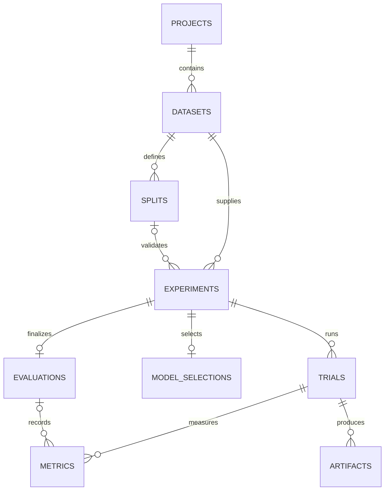
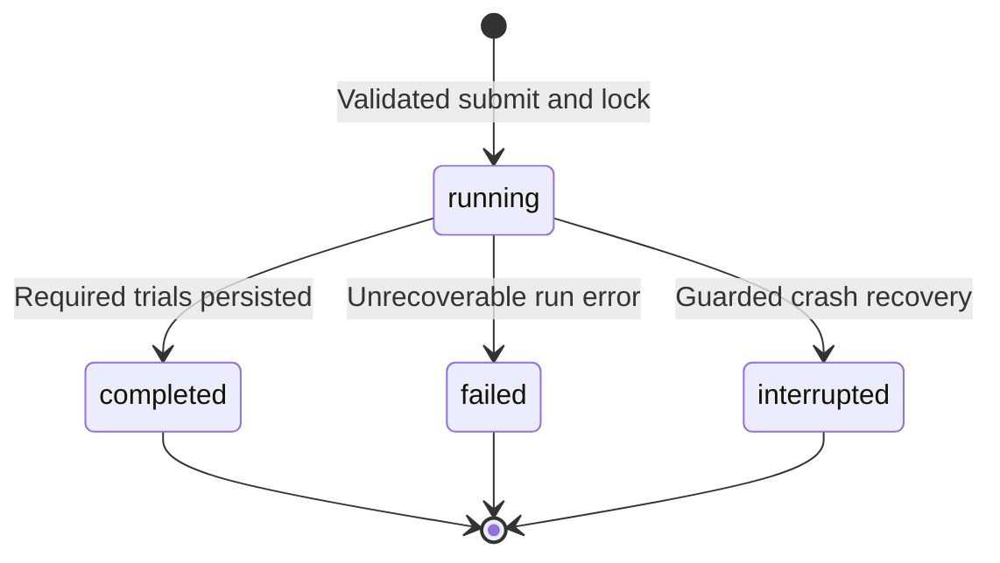

# Database and storage design

## Why a database exists

SQLite stores the experiment catalog and evidence that must survive browser/server restart. Large tabular files and fitted Python objects stay in the artifact store; the DB stores references and checksums. Session state is not a substitute for persistence.

Use [schema.sql](schema.sql) as the baseline for `datamind/storage/migrations/001_initial.sql`. Runtime migration code must apply and record it transactionally. This file is a schema specification, not proof that the application database already exists.

## Entities

| Table | Purpose / key fields |
|---|---|
| projects | Workspace organization; id, name, archive timestamp |
| datasets | Immutable dataset version, source, parser, hash, schema and profile |
| splits | Reusable supervised modeling-view and exact fold manifest |
| experiments | Submitted resolved config, run status, comparison key, environment |
| trials | One algorithm/config attempt inside an experiment, including baseline |
| model_selections | Current CV-selected trial for an experiment |
| evaluations | One persisted holdout evaluation per supervised experiment |
| metrics | Named scalar values with scope, fold, direction and reason if null |
| artifacts | Registered report/model/schema/plot files and integrity metadata |
| schema_migrations | Ordered database schema versions |

## Conventions and invariants

- IDs: generated UUID strings. Datetimes: UTC ISO 8601. Names: display fields, not keys or paths.
- JSON columns are validated through typed models before storage. Serialize NaN/Infinity as invalid, not nonstandard JSON.
- Parameterized queries only. Enable foreign keys on every connection. Set a bounded busy timeout and close per-operation connections.
- Projects own datasets; experiments must reference a dataset in the same project. A split must belong to that experiment's dataset and match task/target. Enforce these cross-record rules in repositories/services; individual FK columns alone do not enforce them.
- Selection, evaluation, metric and artifact trial IDs must belong to the referenced experiment. Guard in service transactions and cover with tests.
- The selection can be set only to a completed trial with a usable saved model. Once evaluation exists, selection/config/metrics for that experiment are immutable.
- `value=null` requires an explanatory reason. Reject nonfinite floats before SQL writes. Standard deviations/label arrays/confusion matrices fit in versioned details JSON or named JSON artifacts.
- Classification/regression require split_id; clustering must have none. A clustering experiment completes with a valid K-Means trial and has no baseline or holdout evaluation.
- `submission_token` enforces request idempotency. A clone/retry always gets a fresh token and ID.

## Status transitions

Partial model failures are retained as failed trials in a completed experiment when the baseline and a real supervised model succeeded. `running` rows are never silently displayed as complete. Finalization adds an immutable evaluation record; it is not a separate training status.

## Write sequencing

1. Acquire workspace lock and resolve submission token.
2. Create running experiment/trial records with committed config.
3. Execute ML without a long open DB transaction.
4. Publish artifacts using temp file → atomic rename; record checksums.
5. Commit trial metrics/status and artifact references together.
6. Persist the selected model, then mark experiment completed.

If file publication succeeds but DB write fails, the file is an unregistered orphan and cannot be loaded by prediction. Guarded recovery reports/cleans only generated unregistered files under storage; it does not delete arbitrary user paths. The UI needs archive, not destructive delete, in v1.

## Example application queries

- History: experiments for selected project ordered by started_at descending, paginated 25 rows.
- Leaderboard: completed runs filtered by exact comparison_key, joined to selections and `cv_mean` primary metrics.
- Holdout exposure: evaluations joined to splits with the current split_fingerprint, across experiments.
- Prediction: selected completed trial → registered model artifact → file existence/hash/environment check.

Do not select a model via `MAX(accuracy)` across unrelated datasets or sort regression error descending.

## Backup and later migration

A useful backup includes a consistent SQLite backup plus referenced datasets/splits/artifacts. Stop training before a manual whole-storage copy, or use SQLite's backup API. SQLite by itself does not back up model files. Schema upgrades must preserve old experiment evidence and be tested against a prior fixture; record applied migration numbers.
